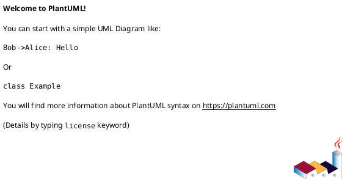

# Advanced ADR Patterns and Best Practices
# أنماط وممارسات ADR المتقدمة

## Introduction / مقدمة

While basic ADRs capture individual decisions, advanced ADR practices help manage complex systems with hundreds of decisions, multiple teams, and evolving architectures. This guide presents patterns for scaling your ADR practice.

بينما تلتقط سجلات ADR الأساسية القرارات الفردية، تساعد ممارسات ADR المتقدمة في إدارة الأنظمة المعقدة بمئات القرارات وفرق متعددة ومعماريات متطورة.

---

## Pattern 1: ADR Chains (Decision Dependencies)
## النمط الأول: سلاسل ADR (تبعيات القرارات)

### Problem / المشكلة
Some decisions depend on or supersede others. Without explicit links, the decision history becomes fragmented and confusing.

### Solution / الحل
Create explicit chains showing decision evolution and dependencies.

### Example / مثال

```markdown
# ADR-015: Migrate from Monolith to Microservices

## Status
Proposed

## Prerequisites (Blocking ADRs)
- ADR-001: Initial Monolith Architecture (must be understood)
- ADR-012: Service Mesh Selection (must be decided first)

## Related Decisions
- ADR-008: Database per Service Pattern
- ADR-014: API Gateway Pattern

## This Decision Enables
- ADR-016: Service Discovery Strategy (blocked until this is accepted)
- ADR-017: Distributed Tracing Implementation
```

### Implementation / التنفيذ

**Automated Link Validation:**
```python
# scripts/validate_adr_links.py
import re
import glob

def validate_adr_links(adr_dir):
    """Validate all ADR cross-references exist"""
    all_adrs = {extract_id(f) for f in glob.glob(f"{adr_dir}/*.md")}

    for adr_file in glob.glob(f"{adr_dir}/*.md"):
        content = open(adr_file).read()
        references = re.findall(r'ADR-(\d+)', content)

        for ref in references:
            if f"ADR-{ref}" not in all_adrs:
                print(f"❌ Broken reference in {adr_file}: ADR-{ref}")
                return False

    return True
```

---

## Pattern 2: ADR Templates by Decision Type
## النمط الثاني: قوالب ADR حسب نوع القرار

### Problem / المشكلة
Not all decisions have the same structure. A technology choice requires different information than a process change.

### Solution / الحل
Create specialized templates for common decision types.

### Template Types / أنواع القوالب

#### Type A: Technology Selection ADR

```markdown
# ADR-XXX: [Technology Choice]

## Status
[Proposed/Accepted/Deprecated]

## Decision Type
**Technology Selection**

## Context
**Problem:** [What problem needs solving?]
**Current State:** [What are we using now?]
**Trigger:** [Why now?]

## Evaluation Criteria
| Criterion | Weight | Tech A | Tech B | Tech C |
|-----------|--------|--------|--------|--------|
| Performance | 30% | 8/10 | 6/10 | 7/10 |
| Ecosystem | 25% | 9/10 | 5/10 | 7/10 |
| Team Expertise | 20% | 4/10 | 9/10 | 6/10 |
| Cost | 15% | 6/10 | 8/10 | 9/10 |
| License | 10% | 10/10 | 5/10 | 8/10 |
| **Weighted Score** | | **7.2** | **6.8** | **7.1** |

## Decision
We will adopt **Tech A** because [reasoning based on scores and qualitative factors].

## Migration Path
1. [Step-by-step migration plan]
2. [Timeline]
3. [Risk mitigation]

## Consequences
**Positive:**
- [Benefit 1]
- [Benefit 2]

**Negative:**
- [Tradeoff 1]
- [Tradeoff 2]

**Mitigation Strategies:**
- [How we address each negative consequence]
```

#### Type B: Process/Practice ADR

```markdown
# ADR-XXX: [Process Change]

## Status
[Proposed/Accepted/Deprecated]

## Decision Type
**Process/Practice**

## Context
**Current Process:** [How do we do things now?]
**Pain Points:** [What's not working?]
**Metrics:** [Quantify the problem]

## Proposed Process
[Detailed description of new process]

## Pilot Plan
**Team:** [Which team will pilot?]
**Duration:** [How long?]
**Success Metrics:** [How will we know it works?]

## Decision
We will [adopt/trial/reject] this process change because [reasoning].

## Rollout Plan
1. Phase 1: [Pilot with Team X]
2. Phase 2: [Expand to Division Y]
3. Phase 3: [Organization-wide]

## Consequences
**Improved Metrics:**
- [Metric 1: Before → After]
- [Metric 2: Before → After]

**Team Impact:**
- [Training needed]
- [Tool changes]
- [Cultural shift]
```

#### Type C: Architecture Pattern ADR

```markdown
# ADR-XXX: [Architecture Pattern]

## Status
[Proposed/Accepted/Deprecated]

## Decision Type
**Architecture Pattern**

## Context
**Current Architecture:** [Diagram or description]
**Scale Challenges:** [What doesn't scale?]
**Complexity Issues:** [What's too complex?]

## Pattern Description
**Name:** [e.g., CQRS, Event Sourcing, Saga Pattern]
**Canonical Example:** [Link to industry example]

## Our Implementation
[How we'll adapt the pattern to our context]



## Decision
We will implement [pattern] in [scope] because [reasoning].

## Implementation Roadmap
**Phase 1:** [Proof of concept]
**Phase 2:** [Single service]
**Phase 3:** [Rollout to additional services]

## Affected Services
- Service A: [Impact and migration plan]
- Service B: [Impact and migration plan]

## Consequences
**Complexity:** [Added/Reduced]
**Performance:** [Impact analysis]
**Operational:** [Monitoring, debugging changes]
```

---

## Pattern 3: ADR Status Workflow
## النمط الثالث: سير عمل حالة ADR

### Lifecycle / دورة الحياة

```
[Proposed] → [In Review] → [Accepted] → [Implemented] → [Validated]
    ↓             ↓                           ↓
[Rejected]   [Deferred]                 [Deprecated]
                                             ↓
                                        [Superseded by ADR-XXX]
```

### Status Definitions / تعريفات الحالة

| Status | Meaning | Next Actions |
|--------|---------|--------------|
| **Draft** | Initial authoring, not yet ready for review | Author completes all sections |
| **Proposed** | Ready for team review | Schedule architecture review meeting |
| **In Review** | Under active discussion | Collect feedback, iterate |
| **Accepted** | Decision approved, not yet implemented | Create implementation tasks |
| **Implemented** | Code reflecting decision is in production | Validate with metrics |
| **Validated** | Confirmed working as expected | Monitor for need to revisit |
| **Rejected** | Decision not approved | Document why, close |
| **Deferred** | Not right timing | Set review date |
| **Deprecated** | Superseded by new decision | Update with successor ADR |

### Automation / الأتمتة

```yaml
# .github/workflows/adr-lifecycle.yml
name: ADR Lifecycle Management

on:
  pull_request:
    paths:
      - 'docs/adr/**'

jobs:
  validate-adr:
    runs-on: ubuntu-latest
    steps:
      - uses: actions/checkout@v3

      - name: Validate ADR Format
        run: |
          python scripts/validate_adr_format.py

      - name: Check Status Transition
        run: |
          python scripts/validate_status_transition.py

      - name: Generate ADR Index
        run: |
          python scripts/generate_adr_index.py

      - name: Notify Stakeholders
        if: contains(github.event.pull_request.title, '[ADR]')
        run: |
          python scripts/notify_adr_stakeholders.py
```

---

## Pattern 4: Impact Analysis Matrix
## النمط الرابع: مصفوفة تحليل التأثير

### Problem / المشكلة
Understanding which layers and teams are affected by a decision requires manual analysis.

### Solution / الحل
Include a structured impact analysis in every ADR.

### Template Section / قسم القالب

```markdown
## Impact Analysis

### Layer Impact
| Layer | Impact Level | Affected Components | Lead Owner |
|-------|-------------|---------------------|-----------|
| 1: Vision | None | - | - |
| 2: AI Strategy | Medium | Model serving pipeline | ML Team |
| 3: Product/UX | Low | Slight API response change | Product |
| 4: Compliance | High | New PII handling required | Legal |
| 5: Security | High | IAM policy changes | SecOps |
| 6: DevOps | Medium | CI/CD pipeline updates | SRE |
| 7: Service Design | High | 3 API contracts change | API Team |
| 8: Data Engineering | Medium | ETL job modifications | Data Team |
| 9: Implementation | High | 5 services need refactoring | Dev Teams |

### Team Impact
| Team | Effort (person-days) | Skills Gap | Training Needed |
|------|----------------------|------------|-----------------|
| Backend Team A | 20 | Medium | Yes - New framework |
| Backend Team B | 15 | Low | No |
| Frontend Team | 5 | None | No |
| Data Team | 30 | High | Yes - New tool |
| SRE Team | 10 | Low | No |

### Risk Assessment
| Risk | Probability | Impact | Mitigation |
|------|------------|--------|------------|
| Service downtime during migration | Medium | High | Blue-green deployment |
| Data loss | Low | Critical | Comprehensive backup strategy |
| Performance regression | Medium | Medium | Load testing before rollout |
```

---

## Pattern 5: Decision Reversal Process
## النمط الخامس: عملية عكس القرار

### When to Reverse / متى نعكس القرار

Not all decisions stand the test of time. Explicitly plan for reversal.

### Template / القالب

```markdown
# ADR-XXX-REVERSAL: Reverting [Original Decision]

## Status
Proposed

## Original Decision
ADR-025: Adopt Microservices Architecture (Accepted 2023-06-15)

## Why We're Reversing
**Evidence:**
- Operational complexity exceeded benefits
- Inter-service latency caused p99 violations (>500ms)
- Team velocity decreased 40% (6 months average)
- Infrastructure costs 3x higher than projected

**Metrics:**
| Metric | Expected | Actual | Gap |
|--------|----------|--------|-----|
| Deploy Time | 10min | 45min | -350% |
| Incident MTTR | 15min | 90min | -500% |
| Infrastructure Cost | $10k/mo | $31k/mo | -310% |

## New Decision
Return to modular monolith architecture with clear internal boundaries.

## Migration Back
1. Phase 1: Consolidate Services A, B, C (Week 1-2)
2. Phase 2: Merge data stores (Week 3-4)
3. Phase 3: Simplify deployment pipeline (Week 5-6)

## Lessons Learned
- [What we learned from the original decision]
- [What we'd do differently]
- [When microservices would have been appropriate]

## This Supersedes
- ADR-025: Adopt Microservices
- ADR-026: Service Mesh Selection
- ADR-030: Distributed Tracing
```

---

## Pattern 6: Experiment-Driven ADRs
## النمط السادس: ADRs مدفوعة بالتجربة

### Problem / المشكلة
Some decisions are too risky to make without validation.

### Solution / الحل
Run explicit experiments before final decision.

### Template / القالب

```markdown
# ADR-XXX: [Technology/Pattern] - EXPERIMENT

## Status
**Experiment Phase** (Proposed → Experiment → Accepted/Rejected)

## Hypothesis
If we adopt [technology/pattern], then [measurable outcome] will improve by [amount].

## Experiment Design
**Duration:** 4 weeks
**Team:** Team Bravo (5 engineers)
**Scope:** User authentication service only
**Control:** Current implementation
**Treatment:** New technology

**Success Criteria:**
| Metric | Current Baseline | Target | Must-Have |
|--------|-----------------|--------|-----------|
| Response time (p95) | 180ms | <150ms | Yes |
| Error rate | 0.1% | <0.05% | Yes |
| Developer velocity | 3 story points/day | >3.5 | No |
| Infrastructure cost | $500/mo | <$600 | Yes |

## Experiment Results
[To be filled after experiment]

**Quantitative:**
| Metric | Baseline | Actual | Delta | Met Goal? |
|--------|----------|--------|-------|-----------|
| [Metric 1] | [Value] | [Value] | [%] | ✅/❌ |

**Qualitative:**
- Developer Experience: [Feedback]
- Operational Complexity: [Assessment]
- Documentation Quality: [Rating]

## Final Decision
Based on experiment results:
- [ ] ✅ **Accept**: Results met all must-have criteria
- [ ] ❌ **Reject**: Failed critical criteria
- [ ] ⏸️ **Defer**: Inconclusive, need longer experiment

## Rollout Plan (if Accepted)
[Phase-by-phase plan based on experiment learnings]
```

---

## Pattern 7: ADR Dashboard
## النمط السابع: لوحة معلومات ADR

### Visualization / التصور

Create a living dashboard showing the health of your architecture decisions.

```python
# scripts/generate_adr_dashboard.py
import glob
import re
from datetime import datetime
import markdown
from collections import Counter

def generate_dashboard(adr_dir):
    """Generate HTML dashboard from ADRs"""

    adrs = []
    for file in glob.glob(f"{adr_dir}/*.md"):
        with open(file) as f:
            content = f.read()
            meta = extract_metadata(content)
            adrs.append(meta)

    # Status distribution
    status_counts = Counter(adr['status'] for adr in adrs)

    # Decisions by layer
    layer_impact = Counter()
    for adr in adrs:
        for layer in adr.get('impacted_layers', []):
            layer_impact[layer] += 1

    # Age analysis
    old_adrs = [a for a in adrs
                if (datetime.now() - a['date']).days > 365
                and a['status'] == 'Accepted']

    # Generate HTML
    html = f"""
    <html>
    <head><title>ADR Dashboard</title></head>
    <body>
        <h1>Architecture Decision Records Dashboard</h1>

        <div class="summary">
            <h2>Overview</h2>
            <p>Total ADRs: {len(adrs)}</p>
            <p>Accepted: {status_counts['Accepted']}</p>
            <p>Proposed: {status_counts['Proposed']}</p>
            <p>Deprecated: {status_counts['Deprecated']}</p>
        </div>

        <div class="alerts">
            <h2>⚠️ Review Needed</h2>
            <p>ADRs older than 1 year: {len(old_adrs)}</p>
            <ul>
                {''.join(f'<li>{a["id"]}: {a["title"]}</li>' for a in old_adrs[:5])}
            </ul>
        </div>

        <div class="layer-impact">
            <h2>Decisions by Layer</h2>
            <svg><!-- Chart showing layer_impact distribution --></svg>
        </div>
    </body>
    </html>
    """

    with open(f"{adr_dir}/dashboard.html", 'w') as f:
        f.write(html)
```

---

## Best Practices Summary / ملخص أفضل الممارسات

### DO ✅

1. **Write ADRs before coding** - Architecture review before implementation review
2. **Link decisions** - Show dependencies and supersessions explicitly
3. **Use templates** - Different decision types need different information
4. **Automate validation** - CI checks for format, links, and completeness
5. **Review regularly** - Quarterly ADR health check meetings
6. **Measure outcomes** - Track whether decisions achieved their goals
7. **Make reversible** - Plan for changing your mind with evidence

### DON'T ❌

1. **Don't document everything** - Not every choice needs an ADR
2. **Don't write novels** - Keep ADRs concise and scannable
3. **Don't hide tradeoffs** - Explicitly acknowledge negatives
4. **Don't skip context** - Future readers need to understand "why"
5. **Don't orphan ADRs** - Every ADR should have a clear owner
6. **Don't fossilize** - Update status as reality changes
7. **Don't gatekeep** - Everyone can propose an ADR

---

## Tools and Automation / الأدوات والأتمتة

### ADR Management Tools

**adr-tools (CLI)**
```bash
# Install
npm install -g adr-tools

# Create new ADR
adr new "Use PostgreSQL for primary data store"

# Link ADRs
adr link 015 "Supersedes" 008

# Generate website
adr generate graph
```

**Log4brains (Web UI)**
```bash
# Install
npx log4brains init

# Start development server
npx log4brains preview

# Build static site
npx log4brains build
```

### Integration with Architecture Tools

```yaml
# Link ADRs to Structurizr
workspace {
    model {
        softwareSystem "Platform" {
            documentation {
                decision 001 {
                    title "Use PostgreSQL"
                    status "Accepted"
                    content "docs/adr/001-postgresql.md"
                }
            }
        }
    }
}
```

---

## Conclusion / الخاتمة

Advanced ADR practices transform decision documentation from a bureaucratic checkbox into a living knowledge base that guides the system's evolution. By implementing these patterns, you create an architecture that is not just well-designed, but well-explained and adaptable.

تحول ممارسات ADR المتقدمة توثيق القرارات من مربع اختيار بيروقراطي إلى قاعدة معرفية حية توجه تطور النظام.

---

## Further Reading / قراءات إضافية

- "Architecture Decision Records" by Michael Nygard (Original ADR concept)
- "Documenting Software Architectures" by Clements et al.
- "Software Architecture in Practice" by Bass, Clements, Kazman
- ThoughtWorks Technology Radar ADR section
