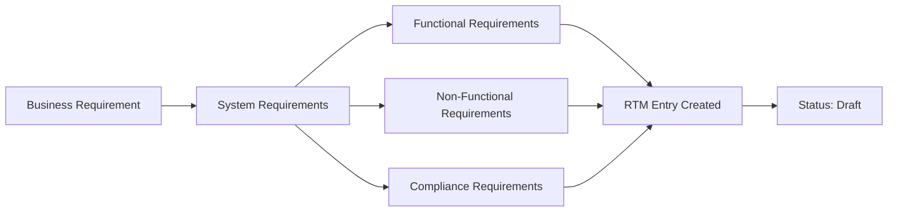

# Requirements Traceability Matrix: Complete Guide
# مصفوفة تتبع المتطلبات: دليل شامل

## Introduction / مقدمة

The Requirements Traceability Matrix (RTM) is the "golden thread" connecting business vision to working code. It proves that every requirement is implemented, tested, and monitored—and that no unnecessary work is being done.

مصفوفة تتبع المتطلبات (RTM) هي "الخيط الذهبي" الذي يربط رؤية الأعمال بالكود العامل. تثبت أن كل متطلب تم تنفيذه واختباره ومراقبته—وأنه لا يتم إجراء عمل غير ضروري.

---

## Why Traceability Matters / لماذا يهم التتبع

### Business Impact / التأثير التجاري

**Scenario 1: Audit Compliance**
```
Auditor: "How do you ensure GDPR Article 17 (Right to Erasure) is implemented?"
You: *Opens RTM, filters by R-GDPR-17*
     "Here are the 4 affected services, their API endpoints,
      the tests proving they work, and the monitoring showing
      erasure requests complete in <24 hours."
```

**Scenario 2: Feature Removal Decision**
```
PM: "Can we remove the 'export to CSV' feature? Nobody uses it."
You: *Checks RTM*
     "That feature exists to satisfy R-COMPLIANCE-045:
      'Users must be able to export their data' (GDPR requirement).
      We can't remove it without violating law."
```

**Scenario 3: Change Impact Analysis**
```
Developer: "I need to refactor Service X's database schema."
You: *Queries RTM for dependencies*
     "That will affect 7 requirements, break 3 API contracts,
      and require updates to 12 tests. Here's the full list."
```

---

## RTM Structure / هيكل RTM

### Core Columns / الأعمدة الأساسية

```csv
R-ID,Description,Priority,Source,ADR-ID,Service,API,Test-ID,Status,Owner,Notes
```

### Extended Columns (Enterprise) / الأعمدة الممتدة (للشركات)

```csv
R-ID,Description,Priority,Category,Source,Stakeholder,ADR-ID,Design-Doc,
Service,API-Spec,Contract-Test,Unit-Test,Integration-Test,E2E-Test,
Performance-Test,Security-Test,Deployment-Status,Monitor-Link,
SLO-Link,Runbook,Status,Owner,Reviewer,Last-Updated,Notes
```

---

## Requirement Hierarchy / تسلسل المتطلبات

### Tier 1: Business Requirements (Vision Layer)
**Format:** `V-###`
**Source:** Vision document, business goals, KPIs
**Example:**

```csv
V-001,"Deliver high-quality personalized recommendations",High,Vision Doc,
V-002,"Ensure user data privacy and GDPR compliance",Critical,Vision Doc,
V-003,"Support 10K concurrent users with <300ms latency",High,Vision Doc,
```

### Tier 2: System Requirements (Cross-Layer)
**Format:** `S-###`
**Source:** Derived from business requirements
**Example:**

```csv
S-001,"API response time p99 < 300ms",High,Derived from V-003,ADR-001,
S-002,"All PII must be encrypted at rest",Critical,Derived from V-002,ADR-005,
S-003,"System uptime > 99.9%",High,Derived from V-003,ADR-001,
```

### Tier 3: Functional Requirements (Service Layer)
**Format:** `F-###`
**Source:** Service design, API contracts
**Example:**

```csv
F-001,"POST /recommendations must accept user_id and context",High,Service Design,ADR-010,RecommendationService,openapi.yaml#/paths/~1recommendations,test_post_recommendations,
F-002,"GET /health must return 200 with {status: ok}",Medium,Service Design,ADR-010,RecommendationService,openapi.yaml#/paths/~1health,test_health_check,
```

### Tier 4: Non-Functional Requirements (Quality Attributes)
**Format:** `NF-###`
**Categories:** Performance, Security, Reliability, Usability, Maintainability

```csv
NF-001,"Authentication token must expire after 1 hour",High,Security,ADR-012,AuthService,test_token_expiry,
NF-002,"Database queries must use connection pooling",Medium,Performance,ADR-015,DataService,test_connection_pool,
NF-003,"All API errors must include correlation ID",High,Observability,ADR-018,AllServices,test_error_correlation,
```

### Tier 5: Compliance Requirements (Regulatory)
**Format:** `C-###` or `R-GDPR-###`, `R-CCPA-###`, etc.

```csv
C-001,"User must be able to delete their account and all data",Critical,GDPR Art. 17,ADR-020,UserService,/api/v1/users/{id},test_user_deletion,
C-002,"Data breach notification within 72 hours",Critical,GDPR Art. 33,ADR-021,SecurityService,runbook-data-breach,
C-003,"Users must opt-in to non-essential cookies",High,GDPR Art. 6,ADR-022,ConsentService,test_cookie_consent,
```

---

## Traceability Patterns / أنماط التتبع

### Pattern 1: Forward Traceability (Vision → Code)

```
Vision Requirement V-001: "High-quality recommendations"
    ↓
System Requirement S-010: "Recommendation accuracy nDCG@10 > 0.85"
    ↓
ADR-025: "Use collaborative filtering with matrix factorization"
    ↓
Service: RecommendationEngine
    ↓
API: POST /recommendations
    ↓
Tests: test_recommendation_accuracy, test_recommendation_diversity
    ↓
Monitoring: Grafana dashboard "ML Model Performance"
    ↓
Validation: Quarterly model accuracy review (last: 0.87 ✅)
```

### Pattern 2: Backward Traceability (Code → Vision)

```
Developer: "Why does this function exist?"
    ↓
Function: anonymize_user_data()
    ↓
Test: test_pii_anonymization
    ↓
API: POST /analytics/ingest (data processing)
    ↓
Service: AnalyticsService
    ↓
ADR-030: "Anonymize all analytics data"
    ↓
Compliance Req C-015: "Analytics must not identify individuals"
    ↓
System Req S-002: "GDPR compliance for all data processing"
    ↓
Vision Req V-002: "Ensure user data privacy"
    ↓
Business Goal: "Build user trust through privacy leadership"
```

### Pattern 3: Horizontal Traceability (Cross-Layer)

```
                    Security Layer (ADR-012)
                            ↓
Authentication Service ← → API Gateway ← → Frontend
                            ↑
                    Compliance Layer (C-005)
```

---

## RTM Maintenance Workflow / سير عمل صيانة RTM

### Stage 1: Requirements Definition



### Stage 2: Design Phase

```markdown
## RTM Update Checklist - Design Phase

- [ ] Link requirement to ADR(s)
- [ ] Identify affected services
- [ ] Reference API specification sections
- [ ] Draft test strategy
- [ ] Assign owner and reviewer
- [ ] Estimate implementation effort
- [ ] Update status to "Designed"
```

### Stage 3: Implementation Phase

```markdown
## RTM Update Checklist - Implementation Phase

- [ ] Link to service repository/branch
- [ ] Link to contract tests (Pact files)
- [ ] Link to unit tests (test file:line)
- [ ] Link to integration tests
- [ ] Code coverage ≥ 60%
- [ ] All tests passing in CI
- [ ] Update status to "Implemented"
```

### Stage 4: Deployment Phase

```markdown
## RTM Update Checklist - Deployment Phase

- [ ] Deployed to staging
- [ ] E2E tests passing
- [ ] Performance tests passing
- [ ] Security scan passed
- [ ] Monitoring configured (SLIs/SLOs)
- [ ] Runbook created (if needed)
- [ ] Deployed to production
- [ ] Update status to "Deployed"
```

### Stage 5: Validation Phase

```markdown
## RTM Update Checklist - Validation Phase

- [ ] Metrics show expected behavior
- [ ] User acceptance testing passed
- [ ] No critical bugs in 2 weeks
- [ ] SLOs met for 30 days
- [ ] Update status to "Validated"
```

---

## Automated RTM Validation / التحقق الآلي من RTM

### Validation Script

```python
# scripts/validate_rtm.py
import pandas as pd
import requests
import yaml
import glob

class RTMValidator:
    def __init__(self, rtm_path, repo_root):
        self.rtm = pd.read_csv(rtm_path)
        self.repo_root = repo_root
        self.errors = []
        self.warnings = []

    def validate_all(self):
        """Run all validation checks"""
        self.check_required_fields()
        self.check_adr_links()
        self.check_api_specs()
        self.check_test_links()
        self.check_orphaned_tests()
        self.check_missing_owners()
        self.generate_report()

    def check_required_fields(self):
        """Ensure all critical fields are populated"""
        required = ['R-ID', 'Description', 'Priority', 'Owner', 'Status']

        for idx, row in self.rtm.iterrows():
            for field in required:
                if pd.isna(row[field]) or row[field] == '':
                    self.errors.append(
                        f"Row {idx}: Missing required field '{field}'"
                    )

    def check_adr_links(self):
        """Verify all ADR references exist"""
        adr_files = {
            f.split('/')[-1].replace('.md', '')
            for f in glob.glob(f"{self.repo_root}/docs/adr/*.md")
        }

        for idx, row in self.rtm.iterrows():
            if pd.notna(row['ADR-ID']):
                adr_id = row['ADR-ID'].strip()
                if adr_id not in adr_files:
                    self.errors.append(
                        f"{row['R-ID']}: ADR '{adr_id}' not found"
                    )

    def check_api_specs(self):
        """Verify OpenAPI spec references are valid"""
        for idx, row in self.rtm.iterrows():
            if pd.notna(row['API-Spec']):
                spec_ref = row['API-Spec']

                # Parse: "openapi.yaml#/paths/~1recommendations"
                if '#' in spec_ref:
                    file, path = spec_ref.split('#')
                    spec_file = f"{self.repo_root}/{file}"

                    try:
                        with open(spec_file) as f:
                            spec = yaml.safe_load(f)

                        # Validate path exists
                        # (Simplified - full implementation would traverse YAML)
                        if not self._path_exists_in_spec(spec, path):
                            self.warnings.append(
                                f"{row['R-ID']}: API path '{path}' not found in {file}"
                            )
                    except FileNotFoundError:
                        self.errors.append(
                            f"{row['R-ID']}: API spec file '{file}' not found"
                        )

    def check_test_links(self):
        """Verify test IDs point to actual tests"""
        test_functions = self._find_all_test_functions()

        for idx, row in self.rtm.iterrows():
            if pd.notna(row['Test-ID']):
                test_id = row['Test-ID'].strip()

                if test_id not in test_functions:
                    self.errors.append(
                        f"{row['R-ID']}: Test '{test_id}' not found in codebase"
                    )

    def check_orphaned_tests(self):
        """Find tests not linked to any requirement"""
        all_tests = self._find_all_test_functions()
        linked_tests = set(self.rtm['Test-ID'].dropna())

        orphaned = all_tests - linked_tests

        if orphaned:
            self.warnings.append(
                f"Found {len(orphaned)} orphaned tests (not in RTM):"
            )
            for test in list(orphaned)[:10]:  # Show first 10
                self.warnings.append(f"  - {test}")

    def check_missing_owners(self):
        """Warn about requirements without owners"""
        no_owner = self.rtm[self.rtm['Owner'].isna()]

        if len(no_owner) > 0:
            self.warnings.append(
                f"{len(no_owner)} requirements have no owner"
            )

    def _find_all_test_functions(self):
        """Find all test function names in the codebase"""
        import ast

        test_functions = set()

        for test_file in glob.glob(f"{self.repo_root}/**/test_*.py", recursive=True):
            with open(test_file) as f:
                try:
                    tree = ast.parse(f.read())
                    for node in ast.walk(tree):
                        if isinstance(node, ast.FunctionDef):
                            if node.name.startswith('test_'):
                                test_functions.add(node.name)
                except:
                    pass

        return test_functions

    def generate_report(self):
        """Print validation report"""
        print("=" * 60)
        print("RTM VALIDATION REPORT")
        print("=" * 60)

        if not self.errors and not self.warnings:
            print("✅ All checks passed!")
            return 0

        if self.errors:
            print(f"\n❌ ERRORS ({len(self.errors)}):")
            for error in self.errors:
                print(f"  {error}")

        if self.warnings:
            print(f"\n⚠️  WARNINGS ({len(self.warnings)}):")
            for warning in self.warnings:
                print(f"  {warning}")

        return 1 if self.errors else 0

if __name__ == "__main__":
    import sys

    validator = RTMValidator(
        rtm_path="docs/RTM.csv",
        repo_root="."
    )

    exit_code = validator.validate_all()
    sys.exit(exit_code)
```

### CI Integration

```yaml
# .github/workflows/rtm-validation.yml
name: Validate RTM

on:
  pull_request:
    paths:
      - 'docs/RTM.csv'
      - 'docs/adr/**'
      - '**/*.py'
      - '**/openapi.yaml'

jobs:
  validate:
    runs-on: ubuntu-latest

    steps:
      - uses: actions/checkout@v3

      - name: Setup Python
        uses: actions/setup-python@v4
        with:
          python-version: '3.9'

      - name: Install dependencies
        run: |
          pip install pandas pyyaml requests

      - name: Validate RTM
        run: |
          python scripts/validate_rtm.py

      - name: Check Coverage
        run: |
          python scripts/check_rtm_coverage.py
```

---

## RTM Coverage Analysis / تحليل تغطية RTM

### Coverage Metrics

```python
# scripts/check_rtm_coverage.py
import pandas as pd

def calculate_coverage(rtm_path):
    """Calculate RTM coverage metrics"""
    rtm = pd.read_csv(rtm_path)

    total_reqs = len(rtm)

    metrics = {
        'total_requirements': total_reqs,
        'with_adr': len(rtm[rtm['ADR-ID'].notna()]),
        'with_service': len(rtm[rtm['Service'].notna()]),
        'with_api': len(rtm[rtm['API-Spec'].notna()]),
        'with_tests': len(rtm[rtm['Test-ID'].notna()]),
        'deployed': len(rtm[rtm['Status'] == 'Deployed']),
        'validated': len(rtm[rtm['Status'] == 'Validated']),
    }

    # Calculate percentages
    percentages = {
        k: round(v / total_reqs * 100, 1)
        for k, v in metrics.items()
        if k != 'total_requirements'
    }

    print("RTM COVERAGE REPORT")
    print("=" * 50)
    print(f"Total Requirements: {total_reqs}")
    print(f"\nCoverage:")
    print(f"  Linked to ADR:     {percentages['with_adr']}%")
    print(f"  Linked to Service: {percentages['with_service']}%")
    print(f"  Linked to API:     {percentages['with_api']}%")
    print(f"  Has Tests:         {percentages['with_tests']}%")
    print(f"  Deployed:          {percentages['deployed']}%")
    print(f"  Validated:         {percentages['validated']}%")

    # Quality gates
    if percentages['with_tests'] < 80:
        print("\n⚠️  WARNING: Test coverage below 80%")
        return 1

    if percentages['deployed'] < 90:
        print("\n⚠️  WARNING: Deployment coverage below 90%")
        return 1

    print("\n✅ All coverage gates passed")
    return 0
```

---

## Advanced RTM Patterns / أنماط RTM متقدمة

### Pattern 1: Multi-Dimensional Traceability

```csv
R-ID,Description,V-Link,S-Link,ADR-Link,Service,API,Test,Monitor,Status
F-042,"User can filter recommendations by category",V-001,S-015,ADR-025,RecommendationService,POST /recommendations,test_category_filter,"grafana/dashboard?id=rec-filters",Validated
```

**Trace Path:**
```
V-001 (Vision: Quality recommendations)
  → S-015 (System: Customizable recommendations)
    → ADR-025 (Decision: Add filtering capability)
      → F-042 (Feature: Category filter)
        → Implementation + Tests + Monitoring
```

### Pattern 2: Compliance Traceability

```csv
R-ID,Type,Regulation,Article,Description,Controls,Tests,Evidence
C-GDPR-17,Compliance,GDPR,Article 17,"Right to erasure","UserService.deleteUser(), DataRetentionJob","test_user_deletion, test_data_purge","audit-logs/deletion-*.json, monthly-compliance-report.pdf"
```

### Pattern 3: Change Impact Traceability

```csv
R-ID,Description,Dependent-Reqs,Dependent-Services,Dependent-Tests,Change-Complexity
F-100,"Change recommendation algorithm",5,"RecommendationService, AnalyticsService, CacheService","test_recommendations, test_analytics, test_cache",High
```

---

## RTM Queries and Reports / استعلامات وتقارير RTM

### Common Queries

```python
# scripts/rtm_queries.py
import pandas as pd

class RTMQueries:
    def __init__(self, rtm_path):
        self.rtm = pd.read_csv(rtm_path)

    def requirements_by_priority(self):
        """Group requirements by priority"""
        return self.rtm.groupby('Priority').size()

    def requirements_by_status(self):
        """Group requirements by status"""
        return self.rtm.groupby('Status').size()

    def requirements_by_owner(self):
        """Group requirements by owner"""
        return self.rtm.groupby('Owner').size()

    def untested_requirements(self):
        """Find requirements without tests"""
        return self.rtm[self.rtm['Test-ID'].isna()]['R-ID'].tolist()

    def unmonitored_requirements(self):
        """Find requirements without monitoring"""
        return self.rtm[self.rtm['Monitor-Link'].isna()]['R-ID'].tolist()

    def requirements_for_service(self, service_name):
        """Get all requirements for a specific service"""
        return self.rtm[self.rtm['Service'] == service_name]

    def impact_of_adr(self, adr_id):
        """Find all requirements affected by an ADR"""
        return self.rtm[self.rtm['ADR-ID'] == adr_id]

    def stale_requirements(self, days=90):
        """Find requirements not updated recently"""
        from datetime import datetime, timedelta

        cutoff = datetime.now() - timedelta(days=days)
        self.rtm['Last-Updated'] = pd.to_datetime(self.rtm['Last-Updated'])

        return self.rtm[self.rtm['Last-Updated'] < cutoff]
```

---

## Best Practices / أفضل الممارسات

### DO ✅

1. **Update RTM continuously** - Not just at milestones
2. **Automate validation** - CI checks on every PR
3. **Keep it current** - Quarterly audit and cleanup
4. **Use consistent IDs** - Don't renumber requirements
5. **Link bidirectionally** - Code comments reference R-IDs
6. **Version RTM** - Track in Git like code
7. **Make it queryable** - CSV/database, not Word doc

### DON'T ❌

1. **Don't create RTM at the end** - Maintain from day 1
2. **Don't duplicate data** - Reference, don't copy
3. **Don't skip orphan checks** - Find untested code
4. **Don't hide in locked files** - Make it accessible
5. **Don't treat as bureaucracy** - It's living documentation
6. **Don't forget to retire** - Remove deprecated requirements

---

## Conclusion / الخاتمة

The RTM is not paperwork—it's the map showing how your system solves real problems. When maintained properly with automation, it becomes an indispensable tool for architecture validation, change impact analysis, and audit compliance.

RTM ليست أوراقًا—إنها الخريطة التي توضح كيف يحل نظامك مشاكل حقيقية.

---

## Templates / القوالب

See `/templates/RTM_TEMPLATE.csv` for the base template.
See `/templates/RTM_TEMPLATE_EXTENDED.csv` for enterprise version.
