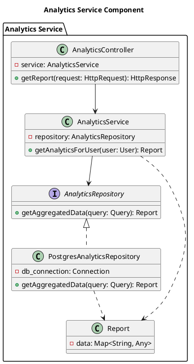

# Level 4: Code Diagram (Optional)
# المستوى الرابع: مخطط الكود (اختياري)

This is the most detailed level of the C4 model. It zooms into an individual component to show how it is implemented in code. This level is often represented by a UML class diagram or a similar technical diagram.

هذا هو المستوى الأكثر تفصيلاً في نموذج C4. يقوم بتكبير مكون فردي لإظهار كيفية تنفيذه في الكود. غالبًا ما يتم تمثيل هذا المستوى بمخطط فئة UML أو مخطط فني مشابه.

## When to Use It / متى تستخدمه

The Code level is **optional** and should be used sparingly. In many modern software development environments, an IDE can already provide an excellent view of the code's structure. You should only create a Code diagram for the most important or complex components where a visual representation adds significant value.

المستوى الرابع **اختياري** ويجب استخدامه باعتدال. في العديد من بيئات تطوير البرامج الحديثة، يمكن لبيئة التطوير المتكاملة (IDE) أن توفر بالفعل عرضًا ممتازًا لهيكل الكود. يجب عليك فقط إنشاء مخطط للكود للمكونات الأكثر أهمية أو تعقيدًا حيث يضيف التمثيل المرئي قيمة كبيرة.

## Key Elements / العناصر الرئيسية

- **Classes, Interfaces, Enums:** The key code elements of the component.
- **Relationships:** How these code elements are related (e.g., inheritance, composition, dependency).
- **Methods and Fields:** Important methods and fields can be shown to clarify the component's behavior.

- **الفئات والواجهات والتعدادات:** عناصر الكود الرئيسية للمكون.
- **العلاقات:** كيفية ارتباط عناصر الكود هذه (على سبيل المثال، الوراثة، التكوين، التبعية).
- **الأساليب والحقول:** يمكن إظهار الأساليب والحقول المهمة لتوضيح سلوك المكون.

## Best Practices / أفضل الممارسات

- **Don't Diagram Everything:** Only diagram the parts of the code that are hard to understand from the code itself.
- **Focus on Abstractions:** Show the key abstractions and design patterns, not every single line of code.
- **Keep it Up-to-Date (or Don't Create It):** An out-of-date diagram is worse than no diagram at all. Consider auto-generation from code if possible.

- **لا ترسم كل شيء:** ارسم فقط أجزاء الكود التي يصعب فهمها من الكود نفسه.
- **التركيز على التجريد:** أظهر التجريدات الرئيسية وأنماط التصميم، وليس كل سطر من الكود.
- **حافظ على تحديثه (أو لا تنشئه):** الرسم البياني القديم أسوأ من عدم وجود رسم بياني على الإطلاق. ضع في اعتبارك الإنشاء التلقائي من التعليمات البرمجية إن أمكن.

## PlantUML Example / مثال PlantUML

This is a UML Class Diagram representing the key classes inside the "Analytics Service" component.

هذا مخطط فئة UML يمثل الفئات الرئيسية داخل مكون "خدمة التحليلات".

